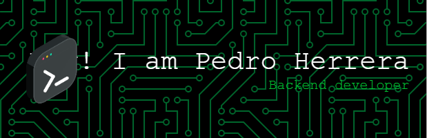

# Hi there 👋, My name is Pedro Herrera

I am a technical draftsman, mining engineer and now in the technology development world, primarily javascript backend (express, fastify), with SQL database management (MySQL, PostgreSQL, Sequelizer), my objective is to become a software engineer to master all processes in the creation of technology products,

## 💫 Liitle Bit More About Me

💬 Ask me about Backend developer

📫 How to reach me? pedro.h.12@outlook.com

## 💻 Skills

## 👥 Connect With Me

